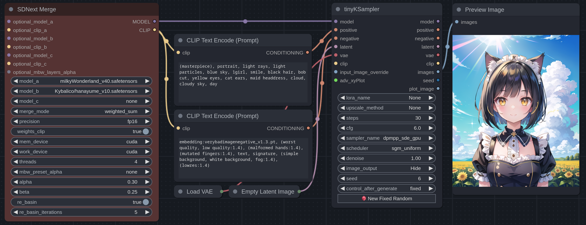
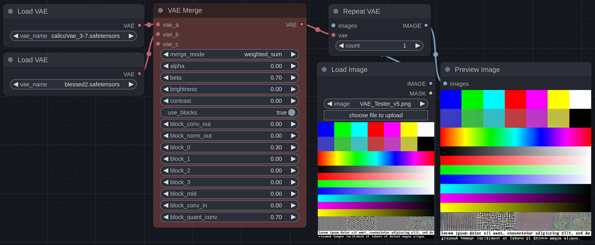
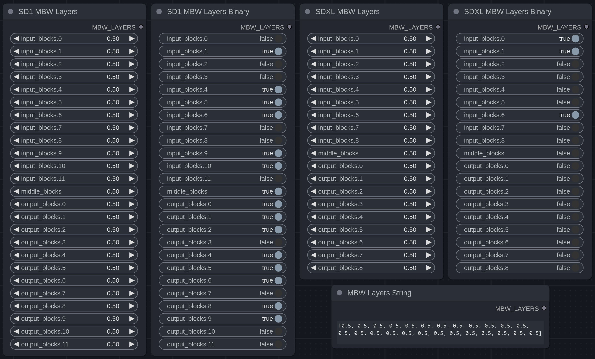
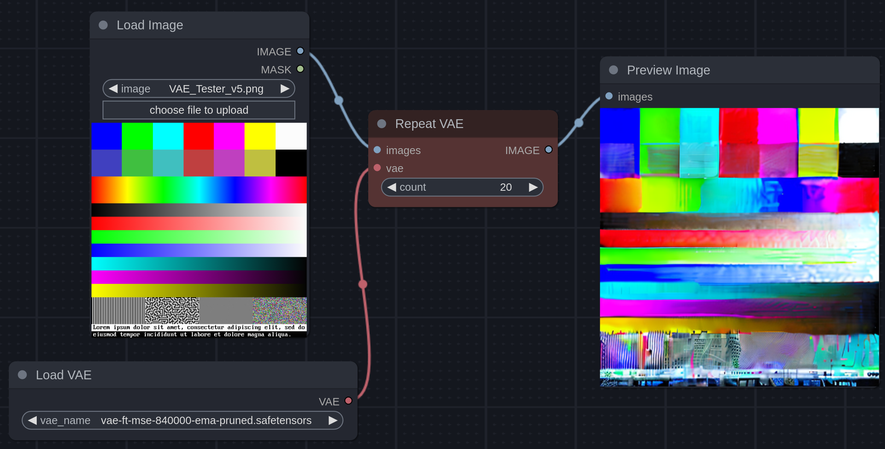
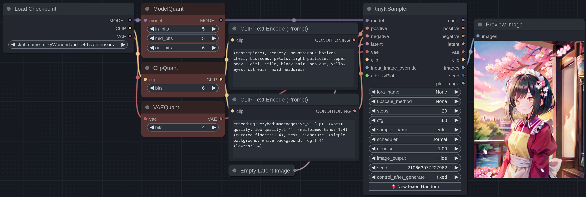

# TechNodes
ComfyUI nodes for merging, testing and more.


## Installation
Inside the `ComfyUI/custom_nodes` directory, run:

```
git clone https://github.com/TechnoByteJS/ComfyUI-TechNodes --depth 1
```

## SDNext Merge
The merger from [SD.Next](https://github.com/vladmandic/automatic) (based on [meh](https://github.com/s1dlx/meh)) ported to ComfyUI, with [Re-Basin](https://github.com/ogkalu2/Merge-Stable-Diffusion-models-without-distortion) built-in.



## VAE Merge
A node that lets you merge VAEs using multiple methods (and support for individual blocks), and adjust the brightness or contrast.



## MBW Layers
Allows for advanced merging by adjusting the alpha of each U-Net block individually, with binary versions that make it easy to extract specific layers.



## Repeat VAE
A node that encodes and decodes an image with a VAE a specified amount of times, useful for testing and comparing the performance of different VAEs.



## Quantization
Quantize the U-Net, CLIP, or VAE to the specified amount of bits
> Note: This is purely experimental, there is no speed or storage benefits from this.



### Credits
To create these nodes, I used code from:
 - [SD.Next](https://github.com/vladmandic/automatic)
 - [meh](https://github.com/s1dlx/meh)
 - [ComfyUI](https://github.com/comfyanonymous/ComfyUI)
 - [VAE-BlessUp](https://github.com/sALTaccount/VAE-BlessUp)

Thank you [Kybalico](https://github.com/kybalico/) and [NovaZone](https://civitai.com/user/nova1337) for helping me test, and providing suggestions! ✨